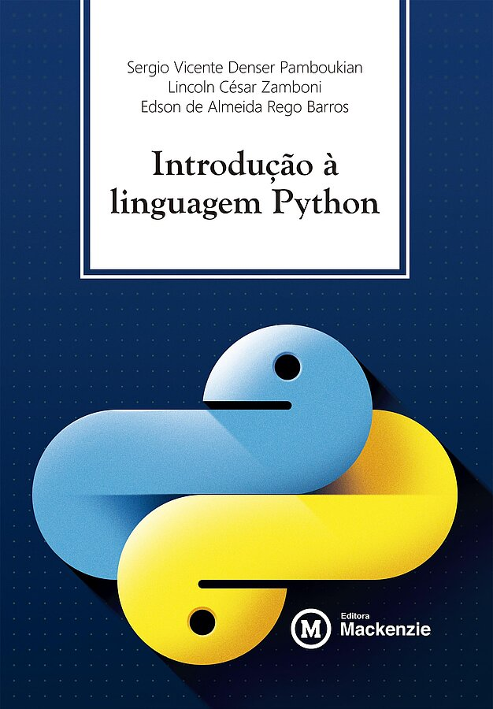
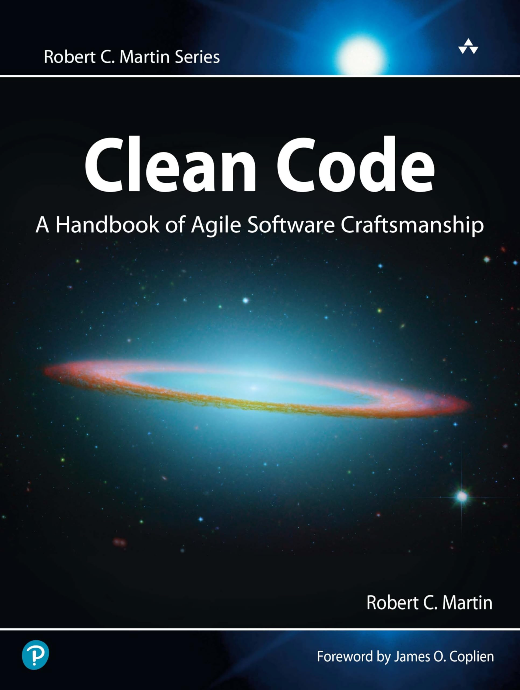

<div align="center">
  
  
  
  
</div>

<br>

<p align="center">
  
</p>

<p align="center">

  
  
</p>

-----

<div align="justify">
<i><b>Olá</b> :wave:, sou o <code>Pedro Henrique</code>, tenho 20 anos, moro em Belo Horizonte e sou estudante de <code>Engenharia de Software</code> na <a href="https://www.pucminas.br/" target="_blank">PUC Minas</a>.</i> :computer: Em constante evolução como desenvolvedor e apaixonado por tecnologia.
</div>

<br>

<div align="center">
<table>
<tr>
 <td align="center" colspan="6"></td>
</tr> 
<tr>

<td>
  <a href="#" target="_blank">
    
  </a>
</td>

<td>
  <a href="#" target="_blank">
    
  </a>
</td>

<td>
  <a href="#" target="_blank">
    
  </a>
</td>

<td>
  <a href="#" target="_blank">
    
  </a>
</td>

<td>
  <a href="#" target="_blank">
    
  </a>
</td>

<td>
  <a href="#" target="_blank">
    
  </a>
</td>

</tr>
<tr>
 <td align="center" colspan="6"></td>
</tr> 
</table>
</div>

-----

<h3>📚 Recomendações de Leitura</h3>
<p><i>Melhores livros da área que eu já estudei e estou estudando para evoluir como profissional. 🚀📖</i></p>
<br>

<div align="center">

<table>
<tr>

<td align="center">
  <br>
  <sub><b>Introdução à Linguagem Python</b></sub><br>
  <sub>Python</sub>
</td>

<td align="center">
  <br>
  <sub><b>Padrões de Projeto</b></sub><br>
  <sub>Erich Gamma, Richard Helm, Ralph Johnson &amp; John Vlissides</sub>
</td>

<td align="center">
  <br>
  <sub><b>Engenharia de Software</b></sub><br>
  <sub>Ian Sommerville</sub>
</td>

<td align="center">
  <br>
  <sub><b>Clean Code</b></sub><br>
  <sub>Robert C. Martin</sub>
</td>

</tr>

<tr><td><br></td></tr>

<tr>

<td align="center">
  <br>
  <sub><b>Pense em Python</b></sub><br>
  <sub>Allen B. Downey</sub>
</td>

<td align="center">
  <br>
  <sub><b>Engenharia de Software Moderna</b></sub><br>
  <sub>Marco Tulio Valente</sub>
</td>

<td align="center">
  <br>
  <sub><b>Fundamentos de Sistemas Operacionais</b></sub><br>
  <sub>Silberschatz, Galvin e Gagne</sub>
</td>

<td align="center">
  <br>
  <sub><b>Scrum</b></sub><br>
  <sub>Jeff Sutherland</sub>
</td>

</tr>
</table>

</div>

---

<div align="center">


<br>
<b>Principais Projetos</b><br><br>

<div align="center">
<table>
<tr>

<td width="420px" align="center">
  <a href="https://github.com/Pedroh26ES/Sistema-De-Moedas-Java" target="_blank">
    
    <br>
    <b>Sistema de Moedas</b>
  </a>
  <br>
  <sub>Aplicação em Java para gerenciar moedas, saldos e operações de troca em uma lógica de sistema financeiro.</sub>
  <br>
  <sub><b>Stack:</b> Java, Programação Orientada a Objetos e arquitetura em camadas</sub>
</td>

<td width="420px" align="center">
  <a href="https://github.com/Pedroh26ES/RoomBookings-Java" target="_blank">
    
    <br>
    <b>RoomBookings</b>
  </a>
  <br>
  <sub>Sistema para reserva de salas, controle de disponibilidade e organização de agendamentos.</sub>
  <br>
  <sub><b>Stack:</b> Java, Programação Orientada a Objetos e persistência de dados</sub>
</td>

</tr>
<tr>

<td width="420px" align="center">
  <a href="https://github.com/Pedroh26ES/Sistema-de-Gestao-das-Olimpiadas-Arquitetura" target="_blank">
    
    <br>
    <b>Gestão das Olimpíadas</b>
  </a>
  <br>
  <sub>Projeto de arquitetura para organizar modalidades, atletas, equipes e informações de uma competição olímpica.</sub>
  <br>
  <sub><b>Stack:</b> Arquitetura de Software, documentação técnica e modelagem de sistemas</sub>
</td>

<td width="420px" align="center">
  <a href="https://github.com/Pedroh26ES/weekly-growth-intelligence-report" target="_blank">
    
    <br>
    <b>Automação com IA</b>
  </a>
  <br>
  <sub>Automação que coleta relatórios, interpreta dados com IA e gera um dashboard executivo semanal.</sub>
  <br>
  <sub><b>Stack:</b> Python, Streamlit, Gemini API, CSV, Excel, PDF e Google Sheets</sub>
</td>

</tr>
</table>
</div>

</div>

-----

<div>


&nbsp;<b>🚀 Tecnologias e Ferramentas</b><br><br>

<b>💻 Linguagens de Programação</b><br>
<p align="left">
  
  
  
  
  
  
  
  
  
  
</p>

<b>🛠️ Frameworks & Bibliotecas</b><br>
<p align="left">
  
  
  
  
  
  
  
  
  
</p>

<b>🗄️ Bancos de Dados & Cache</b><br>
<p align="left">
  
  
  
  
  
  
  
</p>

<b>☁️ Cloud & DevOps</b><br>
<p align="left">
  
  
  
  
  
  
  
</p>

<b>🛠️ Ferramentas & APIs</b><br>
<p align="left">
  
  
  
  
  
</p>

<b>🖥️ IDEs & Editores</b><br>
<p align="left">
  
  
  
  
  
  
</p>

-----

<div>

 <b>🛠️ Ferramentas para Automações, Growth e Inteligência Artificial</b><br>
<p><i>Ferramentas que estou estudando para criar automações, analisar dados, gerar relatórios e aplicar IA em rotinas de Growth.</i></p>

<b>⚙️ Automações & Produtividade</b><br>
<p align="left">
  
  
  
  
  
</p>

<b>🤖 Inteligência Artificial</b><br>
<p align="left">
  
  
  
  
</p>

<b>📈 Growth & Dados</b><br>
<p align="left">
  
  
  
  
</p>

<b>📊 Relatórios & BI</b><br>
<p align="left">
  
  
  
  
  
</p>

</div>


</div>
----
<table>
<tr>
 <td align="center" colspan="2">:watch: <a href="https://wakatime.com/@Pedroh26ES">WakaTime</a></td>
</tr> 
</table>

<table>
<tr>
 <td align="center" colspan="3"></td>
</tr> 
<tr>

<td>

</td>

<td>

</td>

<td>

</td>

</tr>
<tr>
 <td align="center" colspan="3"></td>
</tr> 
</table>

----

```text
 ____           _                _   _                 _                 
|  _ \ ___  __| |_ __ ___      | | | | ___ _ __  _ __(_) __ _ _   _  ___
| |_) / _ \/ _` | '__/ _ \_____| |_| |/ _ \ '_ \| '__| |/ _` | | | |/ _ \
|  __/  __/ (_| | | | (_) |_____|  _  |  __/ | | | |  | | (_| | |_| |  __/
|_|   \___|\__,_|_|  \___/      |_| |_|\___|_| |_|_|  |_|\__, |\__,_|\___|
                                                         |___/
```
